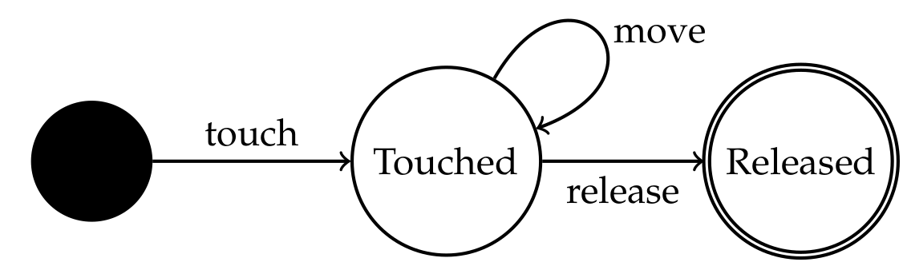

This companion web page contains additional data related to the TSE paper:
- [Details on the data for replication](#data-for-replication)
- [Algorithmic details on the linear undo history](#undo-history)
- [Details on and examples of user interactions](#interacto-user-interactions)
- [Details on Interacto routines](#interacto-routines)
- [Examples of code produced by subjects in RQ5](#rq5-code-examples)


# Data for replication

The different folders of this repository contain data related to a research question (RQ).

Note that RQ3 and RQ4 have no data.


# Undo history

The next listing details the algorithm of the standard linear undo mechanism:

```ts
export class UndoHistory {
    /** The undoable objects. */
    private readonly undos: Array<Undoable>;
    /** The redoable objects. */
    private readonly redos: Array<Undoable>;
    /** The maximal number of undo. */
    private sizeMax: number;

    public constructor() {
        this.sizeMax = 0;
        this.undos = [];
        this.redos = [];
        this.sizeMax = 30;
    }

    /** Adds an undoable object to the collector. */
    public add(undoable: Undoable): void {
        if (this.sizeMax > 0) {
            // Cleaning the oldest undoable object
            if (this.undos.length === this.sizeMax) {
                this.undos.shift();
            }
            this.undos.push(undoable);
            // You must clear the redo stack!
            this.clearRedo();
        }
    }

    private clearRedo(): void {
        if (this.redos.length > 0) {
            this.redos.length = 0;
        }
    }

    /** Undoes the last undoable object. */
    public undo(): void {
        const undoable = this.undos.pop();
        if (undoable !== undefined) {
            undoable.undo();
            this.redos.push(undoable);
        }
    }

    /** Redoes the last undoable object. */
    public redo(): void {
        const undoable = this.redos.pop();
        if (undoable !== undefined) {
            undoable.redo();
            this.undos.push(undoable);
        }
    }
}
```

The current linear implementation in Interacto is located here:
https://github.com/interacto/interacto-ts/blob/master/src/impl/undo/UndoHistoryImpl.ts

<br/><br/>

# Interacto user interactions

The following picture illustrates how a touch-DnD interaction (ie a DnD interaction but using a touchpad instead of a mouse).
A multi-touch interaction involves several instances of this touch-DnD interaction in parallel.



<br/>
The next pictures gives the list of implemented user interactions per platform:


<br/><br/>

# Interacto routines

We detail additional details related to the Interacto API.

***with*: Keyboard Keys.**
Interacto binders that use a keyboard-based user interaction can specify the key codes a user must use.
In the following code, the user interaction of the Interacto binder is *KeysPressure*, a keyboard-based interaction.
The *with* routine specifies the key codes a user must use to produce the UI command (here to produce a *Save* command).
In the example, two key codes are specified: the *control* and *S* key codes.

```java
binder()
  .using(KeysPressure::new)
  .toProduce(d -> new Save(...))
  .on(canvas)
  .with(KeyCode.CONTROL, KeyCode.S)
  .bind();
```

***throttle*: Throttling.**
We design the user interaction throttling feature based on the throttling feature promoted by reactive programming.
In reactive programming, throttling takes as input a duration.
During this duration, only one event (generally the last one) will be emitted.
We adapted this feature for user interactions.
Graphical objects may produce a large number of UI events that user interactions will have to process.
For example with *mouse move*, a graphical object under use will trigger one event on each move of the mouse.
All these events may overload the software.
Our throttling feature also takes as input a duration.
When specified, the user interaction will process the last UI event among all the ones of the same type received during the given duration.
For example, the following Interacto binder uses a DnD interaction and configures this interaction with a throttling value of 30 ms.
If the user moves the mouse 10 times during these 30 ms, the DnD will process the first mouse move and the last mouse move 30 ms after the first one.
If the DnD receives 10 mouse events followed by one mouse release event during less than 30 ms, then the DnD will process the first mouse event, and then the last mouse moves and the mouse release events on receiving this mouse release event.

```java
binder()...
   .using(DnD::new)
   .throttle(30)
   .bind();
```

***strictStart*: Strict Interaction Start.**
When the interaction of an Interacto binding starts, the predicate *when* states whether the Interacto binding can, notably, initialize the command.
One may consider that if this predicate is not respected then the interaction execution must stop.
This is the goal of the *strictStart* routine.
In the following code example, a user can do a DnD on a *canvas* object.
The *when* routine constraints the creation and the execution of the specified *Translate* command (the source X-position of the DnD must be lower than 100).
Since this Interacto binder is configured with *strictStart*, if this predicate is not respected then the interaction execution stops.
This feature permits to stop interaction execution when a *when* predicate will never be *true*.

```java
binder()
   .on(canvas)
   .using(DnD::new)
   .toProduce(d -> new Translate(...))
   .when(d -> d.getSrcPosition().getX() < 100)
   .strictStart()
   .bind();
```

***continuous*: Continuous Command Execution.**
The *continuous* routine specifies that the current UI command will be executed on each update of the interaction execution (if the predicate *when* is respected) instead of being executed at the end of the interaction execution.
This allows users to see the effect of the UI command during the interaction execution.
For example with the following code, the user will see the shape moving while the interaction is running.
Without *continuous*, the user will see the move at the end of the interaction only.
This feature requires the UI command to be undoable:
if the user cancels the interaction (e.g. press the 'ESC' key while doing the drag-lock), then the ongoing UI command must be undone.


```java
binder()
  .using(DragLock::new)
  .toProduce(d -> new Translate(d.getSrcObject().getData())
  .on(canvas.getChildren())
  .when(d -> d.getButton() == MouseButton.SECONDARY)
  .continuous()
  .bind();
```


***consume*: Consume UI events.**
Most of graphical toolkits permit to stop the propagation of a UI event.
In several toolkits, such as JavaFX, this concept is called *consume*.
In a standard case a UI event is successively processed by all its listeners.
When one of such listeners consumes the current event, this stops the propagation of the event to the next listeners.
We reuse this concept for user interactions and Interacto bindings:
When an Interacto binding is configured to *consume* events, its user interaction will consume the UI events it processes.

```java
binder()...
  .consume()
  .bind();
```


***log*: Logging.**
Interacto binding support logging systems at different levels.
In the following code, the Interacto binding will log the user interaction execution.
The other logging levels are:
the *binding level*, that logs information related to the transformation of the interaction execution into UI commands;
the *command level*, that logs information related to the produced UI commands.


```java
binder()...
  .log(LogLevel.INTERACTION)
  .bind();
```

# RQ5 code examples

All the code produced by the subjects is located in the archive `RQ5/subjects-data.tar.xz`.
We give here some illustrative examples of interesting solutions.

## G1 - Interacto

Interacto code that configures Interacto bindings for the three tasks (from subject 11 in G1):

```ts
export class Tp2Component implements AfterViewInit {
  @ViewChild("triple")
  private triple: ElementRef;
  @ViewChild("undoButton")
  private undoButton: ElementRef;
  @ViewChild("redoButton")
  private redoButton: ElementRef;
  @ViewChild("text")
  private text: ElementRef;
  @ViewChild("rec")
  private rec: ElementRef;
  private click: boolean = false;
  @ViewChild("canvas")
  private canvas: ElementRef;

  constructor(public dataService: DataService) {
    dataService;
  }

  ngAfterViewInit(): void {
    buttonBinder()
      .toProduce(() => new Undo())
      .on(this.undoButton.nativeElement)
      .bind();

    buttonBinder()
      .toProduce(() => new Redo())
      .on(this.redoButton.nativeElement)
      .bind();

    clicksBinder(3)
      .on(this.triple.nativeElement)
      .toProduce(() => new RandomColor(this.dataService))
      .bind();

    textInputBinder()
      .on(this.text.nativeElement)
      .toProduce(() => new AnonCmd(
          () => (this.dataService.text = this.text.nativeElement.value)))
      .bind();

    dndBinder(true)
      // The command to produce
      .toProduce(() => new MoveRectangle(this.dataService))
      // What to do when the interaction starts
      .first((c: MoveRectangle, i: SrcTgtTouchData) => {
        // Note that i refers to the current data of the DnD.
        // See the class diagram of SrcTgtTouchData above.
        // And c refers to the ongoing command that can be updated here
        c._x = i.getTgtClientX() - 50 -
          this.canvas.nativeElement.getBoundingClientRect().left;
        c._y = i.getTgtClientY() - 25 -
          this.canvas.nativeElement.getBoundingClientRect().top;
      })
      // What to do when the interaction updates
      .then((c: MoveRectangle, i: SrcTgtTouchData) => {
        // The values of 'i' change on each change of the DnD
        c._x = i.getTgtClientX() - 50 -
          this.canvas.nativeElement.getBoundingClientRect().left;
        c._y = i.getTgtClientY() - 25 -
          this.canvas.nativeElement.getBoundingClientRect().top;
      })
      // When the interaction stops
      .end((c: MoveRectangle, i: SrcTgtTouchData) => {
        c._x = i.getTgtClientX() - 50 -
          this.canvas.nativeElement.getBoundingClientRect().left;
        c._y = i.getTgtClientY() - 25 -
          this.canvas.nativeElement.getBoundingClientRect().top;
      })
      // On which widget the interaction operates
      .on(this.rec.nativeElement)
      // continuous execution means that the command is executed each time the interaction updates
      .continuousExecution()
      .bind();
  }
}
```

An example of a valid Interacto command (from the same subject 11):

```ts
export class MoveRectangle extends CommandBase implements Undoable {
  private mementoX: number;
  private mementoY: number;
  public _x: number;
  public _y: number;

  public constructor(private dataService: DataService) {
    super();
  }

  protected execution(): void {
    this.dataService.position.x = this._x;
    this.dataService.position.y = this._y;
  }

  undo(): void {
    this.dataService.position.x = this.mementoX;
    this.dataService.position.y = this.mementoY;
  }
  redo(): void {
    this.execution();
  }
  getUndoName(): string {
    return "Move Rectangle";
  }

  createMemento() {
    this.mementoX = this.dataService.position.x;
    this.mementoY = this.dataService.position.y;
  }
}
```


## G2 - Native Angular

Native Angular code for the three tasks (from subject 17 in G2):

```ts
export class Tp2Component implements AfterViewInit {
    textAreaChanged: Subject<string> = new Subject<string>();
    textAreaText: string;

    private startedPos: Position;
    private startedScreenPosition;

    constructor(public dataService: DataService, private history: HistoryService) {
        this.textAreaChanged
            .pipe(debounceTime(1000), distinctUntilChanged())
            .subscribe(model => {
                this.dataService.text = model;
            });
    }

    ngAfterViewInit(): void {
    }

    onTripleClickButton($event: MouseEvent) {
        if ($event.detail % 3 === 0) {
            this.history.execute(new ColorCommand(this.dataService, this.dataService.color, this.dataService.generateRandomColor()));
        }
    }

    undo() {
        this.history.undo();
    }

    redo() {
        this.history.redo();
    }

    onTextAreaChange(query: string) {
        this.textAreaChanged.next(query);
    }

    dragDropped() {
        console.log(this.startedPos, this.dataService.position);
    }

    dragStarted() {
        this.startedPos = this.dataService.position;
    }

    onMouseUp($event: MouseEvent) {
        const oldPos = {x: this.startedPos.x, y: this.startedPos.y};
        console.log($event);
        const diffX = $event.screenX - this.startedScreenPosition.x;
        const diffY = $event.screenY - this.startedScreenPosition.y;
        this.startedPos.x += diffX;
        this.startedPos.y += diffY;
        console.log(this.startedPos);
        this.history.execute(new DragCommand(this.dataService, oldPos, this.startedPos));
    }

    onMouseDown($event: MouseEvent) {
        this.startedPos = this.dataService.position;
        this.startedScreenPosition = {x: $event.screenX, y: $event.screenY};
    }
}
```

This subject coded himself/herself an undo history and the base classes for commands:

```ts
@Injectable({
    providedIn: 'root'
})
export class HistoryService {

    private undoables: Command[] = [];
    private redoables: Command[] = [];

    constructor() {
    }

    execute(command: Command) {
        if (command.apply()) {
            this.undoables.push(command);
            this.redoables = [];
            return true;
        }

        return false;
    }

    undo() {
        if (this.undoables.length !== 0) {
            const command = this.undoables.pop();
            command.revert();
            this.redoables.push(command);
        }
    }

    redo() {
        if (this.redoables.length !== 0) {
            const command = this.redoables.pop();
            command.apply();
            this.undoables.push(command);
        }
    }
}
```

An example of a command produced by the same subject:

```ts
export class DragCommand implements Command {
    constructor(private dataService: DataService, private oldPos: Position, private newPos: Position) {
    }

    apply(): boolean {
        this.dataService.position = this.newPos;
        return true;
    }

    revert(): boolean {
        this.dataService.position = this.oldPos;
        return true;
    }

}
  ```
